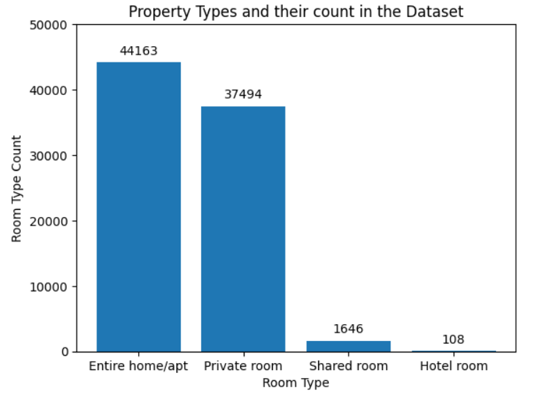
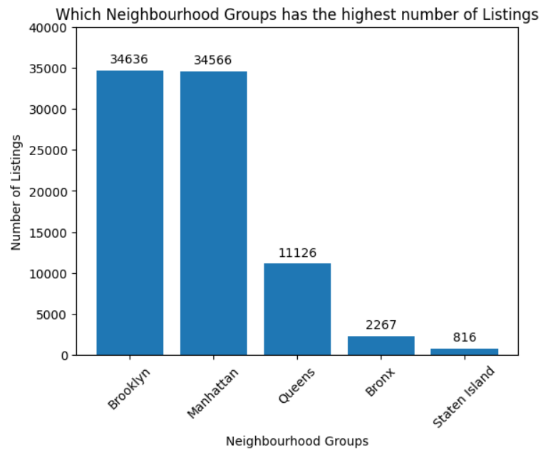
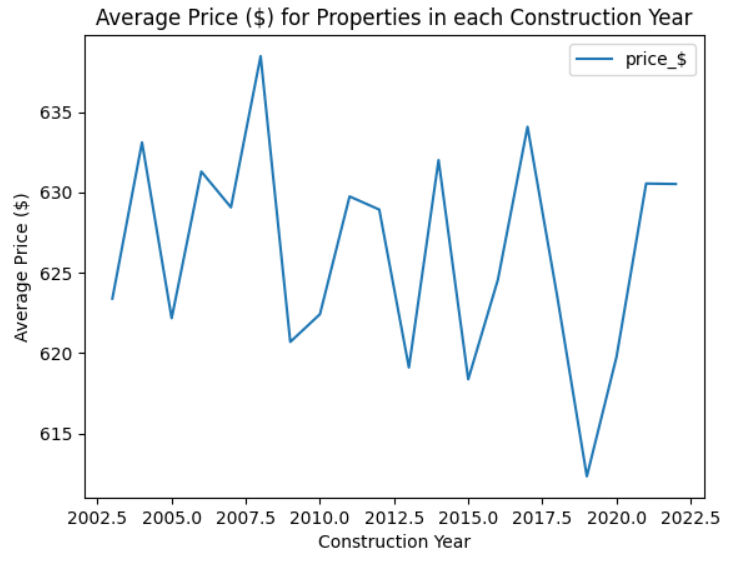
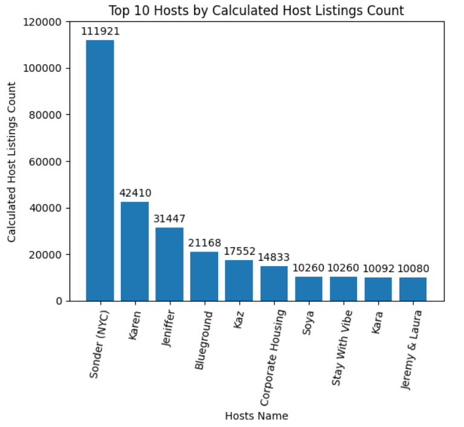
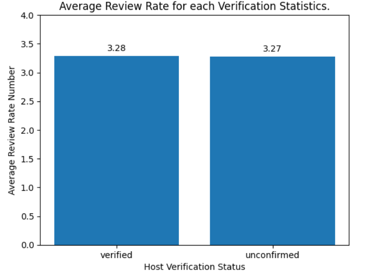
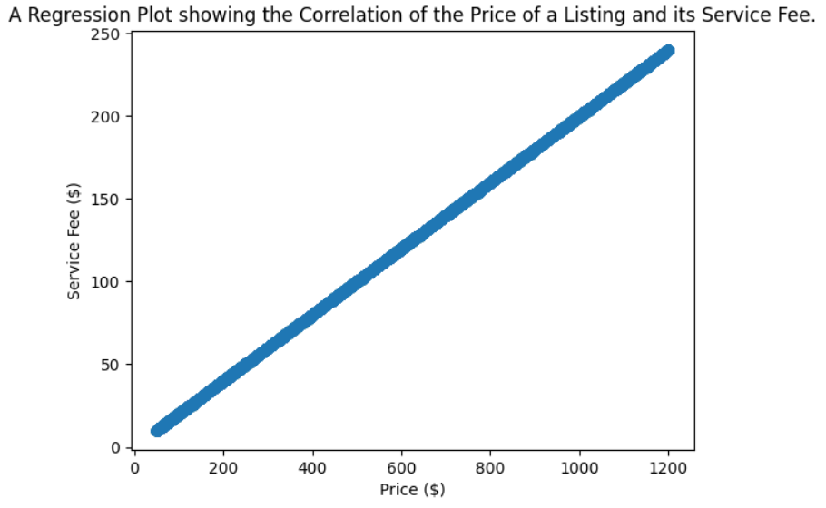
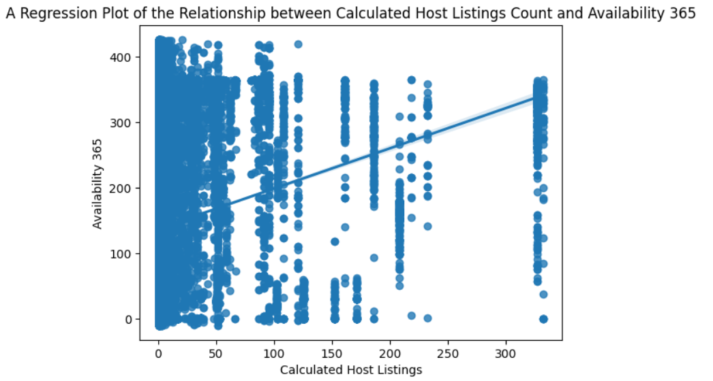

# 🏨 Airbnb Hotel Booking Analysis: A Data-Driven Exploration of NYC Listings 🗽📊

This repository contains a comprehensive **data analysis project** focused on an open-source Airbnb dataset.
The goal of this project is to perform **Exploratory Data Analysis (EDA)** to uncover key trends, patterns, and correlations, providing insights into the factors that influence Airbnb listings in **New York City**.

The analysis and visualization process is documented in a **Jupyter Notebook**, utilizing the following Python libraries:

* pandas → Data manipulation
* numpy → Numerical operations
* matplotlib & seaborn → Static data visualization
* plotly.express → Interactive data visualization

---

## 📑 Table of Contents

1. [📦 Dataset: A Closer Look](#-dataset-a-closer-look)
2. [🧹 Data Cleaning & Preprocessing](#-data-cleaning--preprocessing)
3. [📈 Key Findings & Visualizations](#-key-findings--visualizations)

   * [Price & Service Fee Relationship](#1-price--service-fee-relationship)
   * [Host Performance & Identity Verification](#2-host-performance--identity-verification)
   * [Top-Performing Hosts by Listings](#3-top-performing-hosts-by-listings)
   * [Geographical Distribution & Property Types](#4-geographical-distribution--property-types)
   * [Average Price by Neighborhood Group](#5-average-price-by-neighborhood-group)
   * [Host Listings vs. Availability](#6-host-listings-vs-availability)
4. [📊 Sample Visualizations](#-sample-visualizations)
5. [🚀 How to Run this Notebook](#-how-to-run-this-notebook)
6. [📌 Summary](#-summary)

---

## 📦 Dataset: A Closer Look

The dataset used is `Airbnb_Open_Data.csv`, which contains rich details about Airbnb listings.

### Listing Details

* id → Unique identifier for each listing
* NAME → Title of the Airbnb listing
* host id → Unique identifier for the host
* host_name → Name of the host
* host_identity_verified → Whether host identity is verified
* room type → Type of room (Entire home/apt, Private room, etc.)
* Construction year → Year property was built
* house_rules → Rules for the property
* license → Licensing information

### Location

* neighbourhood group → Borough (Manhattan, Brooklyn, etc.)
* neighbourhood → Specific neighborhood
* lat & long → Latitude and longitude 📍

### Pricing & Booking

* price_$ → Price per night (cleaned for analysis 💰)
* service_fee_$ → Service fee (cleaned 💸)
* minimum nights → Minimum nights required
* instant_bookable → Instant booking availability

### Reviews & Availability

* number of reviews → Total number of reviews
* last review → Date of the last review
* reviews per month → Average monthly reviews
* review rate number → Numerical rating ⭐
* calculated host listings count → Listings per host
* availability 365 → Availability in days per year 🗓️

---

## 🧹 Data Cleaning & Preprocessing

1. Handling Missing Values → Dropped rows with missing data
2. Removing Duplicates → 541 duplicates removed → 102,058 unique records remain
3. Feature Engineering

   * Cleaned price & service fee by removing `$` and converting to float
   * Converted id & host id → string
   * Parsed last review → datetime
4. Standardizing Data → Fixed typo "brookln" → "Brooklyn"
5. Filtering Outliers → Removed listings with availability 365 > 500

---

## 📈 Key Findings & Visualizations

### 1. Price & Service Fee Relationship

* Observation → Correlation coefficient ~ 0.9999 between price and service fee
* Visualization → Regression plot showing near-perfect linear trend

### 2. Host Performance & Identity Verification

* Verified hosts → Avg. review rate = 3.28
* Unverified hosts → Avg. review rate = 3.27
* Interpretation → Minimal difference, quality matters more than verification

### 3. Top-Performing Hosts by Listings

* Top 10 hosts manage a large share of listings
* Visualization → Bar chart of top 10 hosts by listing count
* Some professional hosts have 100k+ listings 👑

### 4. Geographical Distribution & Property Types

* Most Listings → Brooklyn & Manhattan
* Room Types → Entire home/apt > Private room
* Visualization →

  * "Which Neighbourhood Groups have the Highest Listings"
  * "Property Types and their Count in the Dataset"

### 5. Average Price by Neighborhood Group

* Observation → Prices vary significantly across boroughs
* Visualization → Bar chart "Average Price per Listings ($) in each Neighborhood Group"

### 6. Host Listings vs. Availability

* Correlation → Weak positive (~0.14) between host listing count & availability
* Interpretation → Availability strategy differs across hosts

---

## 📊 Sample Visualizations

Below are examples of the plots generated in this project.

* 🔹 Room Type Distribution
  

* 🔹 Listings by Borough
  

* 🔹 Average Price per Neighborhood Group
  

* 🔹 Average Price for Properties in each Construction Year
  

* 🔹 Top 10 Hosts by Listings
  

* 🔹 Host Verification vs. Review Rate
    

* 🔹 Price vs. Service Fee Regression Plot
  

* 🔹 Average Review Rate for each Room/Property Type in each Neighbourhood Group
  

* 🔹 Host Listing Count vs. Availability
  

---

## 🚀 How to Run this Notebook

### Prerequisites

* Install Python
* Install required libraries:

  ```
  pip install pandas numpy matplotlib seaborn plotly.express
  ```
* Download `Airbnb_Open_Data.csv` and place it in the same directory

### Running the Notebook

1. Open `Vedant_Bende.ipynb` in JupyterLab, Google Colab, or Anaconda
2. Run cells sequentially → view cleaning, analysis, & visualizations
3. Plotly charts are interactive → Hover for details 🖱️

---

## 📌 Summary

This project highlights:

* Strong ties between price and service fees
* Minimal effect of host verification on reviews
* Dominance of large-scale property managers
* Brooklyn & Manhattan → Airbnb hotspots
* Pricing disparities across boroughs

---

✨ Developed with **Python, Jupyter, and Data Visualization Tools** ✨

---
